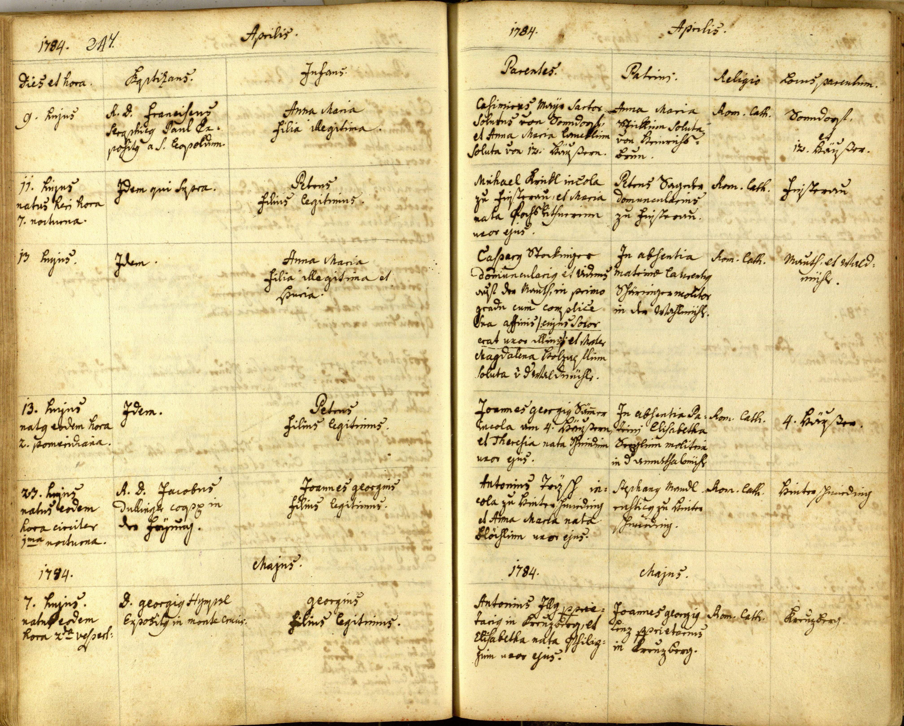
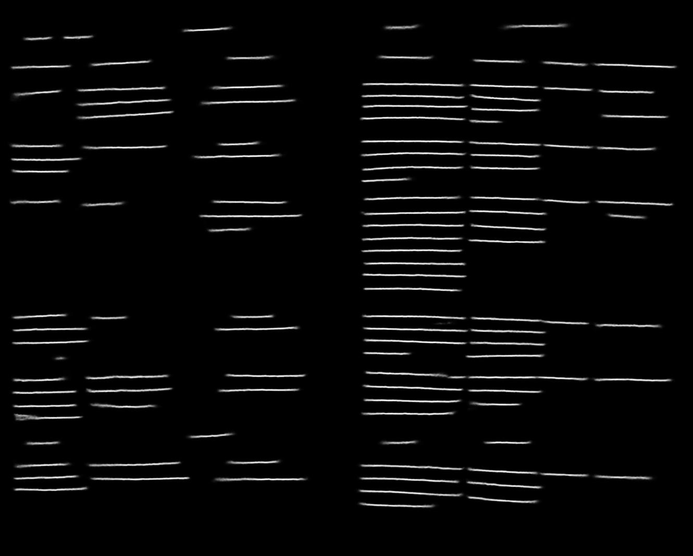

# ARU-Net: A Neural Pixel Labeler for Layout Analysis of Historical Documents

## Contents
* [Introduction](#introduction)
* [Installation](#installation)
* [Demo](#demo)
* [Training](#training)

## Introduction 
This is the Tensorflow code corresponding to [A Two-Stage Method for Text Line Detection in Historical Documents
](#a-two-stage-method-for-text-line-detection-in-historical-documents).
The features are summarized below:
+ Inference Demo
    + trained and freezed tensorflow graph included
    + easy to reuse for own inference tests
+ Workflow 
    + full training workflow to parametrize and train your own models
    + contains different models, data augmentation strategies, loss functions 
    + training on specific GPU, this enables the training of several models on a multi GPU system
    + to train efficiently on GPUs with arbitrarily sized images the "TF_CUDNN_USE_AUTOTUNE" is disabled

Please cite his [1](#a-two-stage-method-for-text-line-detection-in-historical-documents) if you find this repo useful and/or use this software for own work.


## Installation
1. Any version of tensorflow version > 1.0 should be ok.
2. python packages: matplotlib (>=1.3.1), pillow (>=2.1.0), scipy (>=1.0.0), scikit-image (>=0.13.1), click (>=5.x)
3. Clone the Repo

## Demo
To run the demo follow:
+ open a shell
+ make sure Tensorflow is available, e.g., go to docker environment, activate conda, ... 
+ navigate to ....../ARU-Net
+ run:
```
python run_demo_inference.py 
```

The demo will load a trained model and perform inference for five sample images of the cBad test set CITE.
The network was trained to predict the position of baselines and separators for the begining and end of each text line.
After running the python script you should see a matplot window. To go to the next image just close it.

### Example
An example image of the cBad test set [2](#READ-BAD:-A-New-Dataset-and-Evaluation-Scheme-for-Baseline-Detection-in-Archival-Documents), and the preduced prediction maps are shown below.





## Training
This section describes step-by-step the procedure to train your own model.

### Train data: 
    + The images along with its pixel ground truth have to be in the same folder
    + for each image:  X.jpg, there have to be images named X_GT0.jpg, X_GT1.jpg, X_GT2.jpg, ... (for each channel to be predicted one GT image)
    + each ground truth image is binary and contains ones at positions where the corresponding class is present and zeros otherwise
    + generate a list containing row-wise the absolute pathes to the images (just the document images not the GT ones)
### Val data:
    see [train data](#train-data)
### Train the model:
    + Have a look at the pix_lab/main/train_aru.py script
    + Parametrize it like you wish (have a look at the data_provider, cost and optimizer scripts to see all parameter)
    + Setting the correct paths and using the default parametrization should work fine for a first training
    + run:
    ```
    python -u pix_lab/main/train_aru.py > info.log &
    ```
### Validate the model:
    + train and val losses are printed in info.log
    + to validate the checkpoints using the classical weights as well as its ema-shadows, adjust and run: 
    ```
    pix_lab/main/validate_ckpt.py
    ```
    

    
## References

Please cite [1](#a-two-stage-method-for-text-line-detection-in-historical-documents) if using this code.

### A Two-Stage Method for Text Line Detection in Historical Documents

[1] 

### READ-BAD: A New Dataset and Evaluation Scheme for Baseline Detection in Archival Documents

[2] T. Grüning\*, R. Labahn, M. Diem, F. Kleber, S. Fiel, [*READ-BAD: A New Dataset and Evaluation Scheme for Baseline Detection in Archival Documents*](https://arxiv.org/abs/1705.03311)

```
@article{gruning2017read,
author = {Gr{\"{u}}ning, Tobias and Labahn, Roger and Diem, Markus and Kleber, Florian and Fiel, Stefan},
journal = {arXiv preprint arXiv:1705.03311},
title = {{READ-BAD: A New Dataset and Evaluation Scheme for Baseline Detection in Archival Documents}},
year = {2017}
}
```

    
