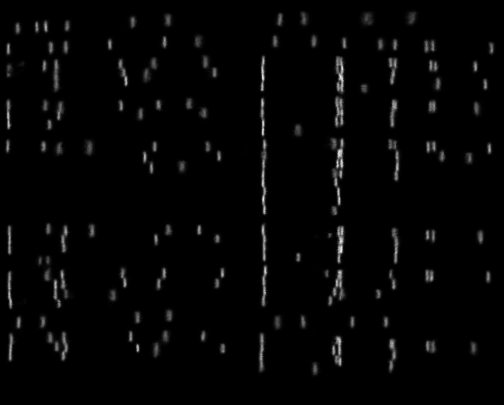

# ARU-Net: A Neural Pixel Labeler for Layout Analysis of Historical Documents

### Introduction 
This is the Tensorflow code corresponding to [A Two-Stage Method for Text Line Detection in Historical Documents
](TBD).
The features are summarized below:
+ Inference Demo
    + trained and freezed tensorflow graph included
    + easy to reuse for own inference tests
+ Workflow 
    + full training workflow to parametrize and train your own models
    + contains different models, data augmentation strategies, loss functions 
    + training on specific GPU, this enables the training of several models on a multi GPU system
    + to train efficiently on GPUs with arbitrarily sized images the "TF_CUDNN_USE_AUTOTUNE" is disabled

Please cite his [paper](TBD) if you find this useful and/or use this software for own work.

### Contents
1. [Installation](#installation)
2. [Demo](#demo)
3. [Train](#train)

### Installation
1. Any version of tensorflow version > 1.0 should be ok.
2. python packages: matplotlib (>=1.3.1), pillow (>=2.1.0), scipy (>=1.0.0), scikit-image (>=0.13.1), click (>=5.x)
3. Clone the Repo

### Demo
To run the demo follow:
+ open a shell
+ make sure Tensorflow is available, e.g., go to docker environment, activate conda, ... 
+ navigate to ....../ARU-Net
+ run:
```
python run_demo_inference.py 
```

The demo will load a trained model and perform inference for five sample images of the cBad test set CITE.
The network was trained to predict the position of baselines and separators for the begining and end of each text line.
After running the python script you should see a matplot window. To go to the next image just close it.
An image and the preduced prediction maps are shown below.





### Train
This section describes step-by-step the procedure to train your own model.
